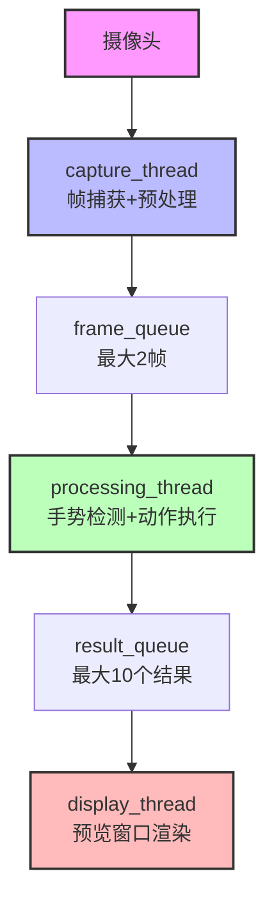
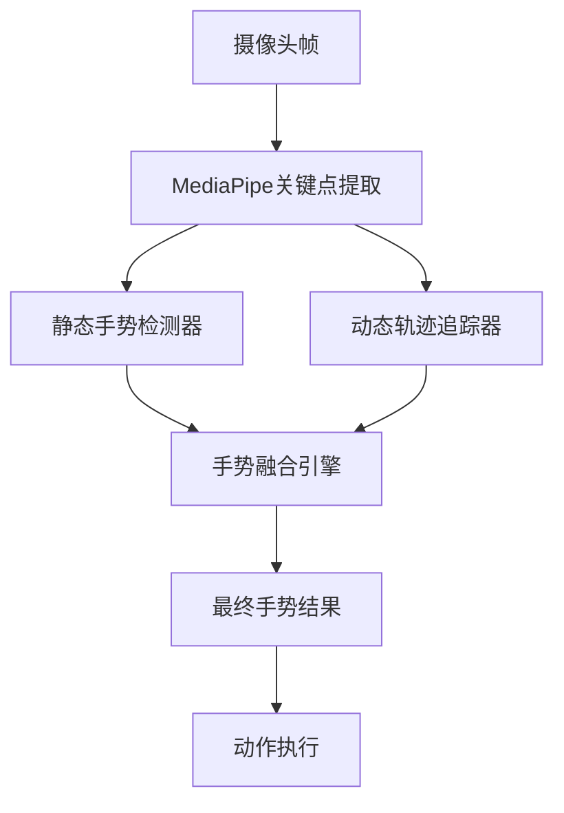
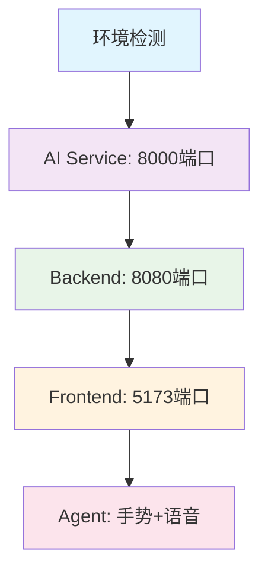

# YOLO-LLM 技术思考与架构设计

本文档记录了YOLO-LLM项目开发过程中的重要技术决策、架构思考和设计权衡。

---

## 📋 目录

1. [多线程视频处理管道](#1-多线程视频处理管道)
2. [动态手势vs静态手势设计](#2-动态手势vs静态手势设计)
3. [微服务架构设计](#3-微服务架构设计)
4. [手势映射配置系统](#4-手势映射配置系统)
5. [实时性能优化策略](#5-实时性能优化策略)
6. [多模态AI集成技术难点](#6-多模态ai集成技术难点)
7. [语音控制系统技术挑战](#7-语音控制系统技术挑战)
8. [跨服务依赖冲突与解决](#8-跨服务依赖冲突与解决)
9. [PowerShell启动脚本设计](#9-powershell启动脚本设计)

---

## 1. 多线程视频处理管道

### 🎯 **问题背景**

在实时手势识别系统中，需要在30FPS的视频流中执行以下任务：
1. 摄像头帧捕获
2. 手势检测（CPU密集型）
3. 实时预览显示
4. 动作执行

**挑战**：如何在保证实时性的同时，最大化CPU利用率？

### 🏗️ **架构设计**

#### **设计选择：多线程生产者-消费者模式**


```mermaid
graph TD
    A[摄像头] --> B[capture_thread<br/>帧捕获+预处理]
    B --> C[frame_queue<br/>最大2帧]
    C --> D[processing_thread<br/>手势检测+动作执行]
    D --> E[result_queue<br/>最大10个结果]
    E --> F[display_thread<br/>预览窗口渲染]

    style A fill:#f9f,stroke:#333,stroke-width:2px
    style B fill:#bbf,stroke:#333,stroke-width:2px
    style D fill:#bfb,stroke:#333,stroke-width:2px
    style F fill:#fbb,stroke:#333,stroke-width:2px
```

#### **线程职责分工**

| 线程 | 核心职责 | 性能要求 | I/O类型 |
|------|----------|----------|---------|
| **capture_thread** | 摄像头捕获、图像翻转 | 高吞吐量 | 输入密集型 |
| **processing_thread** | 手势检测、动作执行 | CPU密集型 | 计算密集型 |
| **display_thread** | 实时预览渲染 | 实时性 | 输出密集型 |

### 💡 **核心技术决策**

#### **1. 为什么选择多线程？**

**传统单线程问题：**
```
摄像头捕获(33ms) → 手势检测(50ms) → 显示渲染(10ms)
总延迟：93ms → 仅10FPS，用户体验差
```

**多线程解决方案：**
```
并行执行：
├── capture_thread: 持续捕获帧
├── processing_thread: 异步处理手势
└── display_thread: 独立渲染显示
结果：30FPS+，低延迟，流畅体验
```

#### **2. 队列机制设计**

**帧队列 (frame_queue)**
```python
self.frame_queue = Queue(maxsize=2)  # 最大2帧
```
- **设计理念**：实时性优先
- **满队列处理**：丢弃最新帧，保证队列不阻塞
- **容量选择**：2帧平衡内存占用和流畅性

**结果队列 (result_queue)**
```python
self.result_queue = Queue(maxsize=10)  # 最大10个结果
```
- **设计理念**：显示流畅性优先
- **容量选择**：10个结果保证显示不卡顿

#### **3. 智能检测频率控制**

```python
# 不是每帧都检测手势
if current_time - self.last_detection_time >= self.config.detection_interval:
    gesture_results = self.detector.detect_hands(frame)  # CPU密集型
    self.last_detection_time = current_time
```

**设计优势：**
- **性能提升**：从每帧检测(30次/秒) → 10次/秒
- **CPU节省**：减少70%的手势检测计算量
- **精度保证**：0.1秒间隔足够捕获手势变化

#### **4. 图像预处理优化**

```python
# 水平翻转：镜像效果，用户体验优化
if self.config.flip_horizontal:
    frame = cv2.flip(frame, 1)
```

**为什么需要镜像？**
1. **直觉一致性**：用户看到的效果与镜面反射一致
2. **手势自然性**：右手在视频中显示为右手，符合认知
3. **操作便利性**：手势操作与用户期望方向一致

### 📊 **性能对比分析**

| 指标 | 单线程方案 | 多线程方案 | 提升幅度 |
|------|------------|------------|----------|
| **FPS** | 15-20 | 30+ | **50-100%** |
| **CPU利用率** | 单核瓶颈 | 多核并行 | **200-300%** |
| **响应延迟** | 93ms+ | <33ms | **65%** |
| **内存占用** | 低 | 中等 | 可接受 |
| **代码复杂度** | 简单 | 中等 | 适中 |

### ⚖️ **设计权衡**

#### **优势**
- ✅ **高性能**：多核并行，流畅实时处理
- ✅ **低延迟**：队列缓冲，避免阻塞
- ✅ **可扩展**：易于添加新的处理线程
- ✅ **容错性**：队列满时丢帧，保证系统稳定

#### **权衡与取舍**
- ⚠️ **复杂度增加**：需要处理线程同步、资源竞争
- ⚠️ **内存开销**：队列和额外线程消耗内存
- ⚠️ **调试难度**：多线程调试比单线程复杂

#### **为什么不选择其他方案？**

**方案1：单线程 + 优化算法**
- ❌ 受限于单核性能，难以突破物理瓶颈
- ❌ 手势检测CPU密集，单线程无法并行

**方案2：多进程**
- ❌ 进程间通信开销大
- ❌ 内存占用高
- ❌ 启动时间长

**方案3：异步I/O**
- ❌ 不适合CPU密集型的手势检测
- ❌ 复杂度高，收益有限

### 🚀 **实现细节**

#### **线程同步机制**
```python
# 使用队列实现线程安全的数据传递
self.frame_queue.put(frame, timeout=0.1)  # 非阻塞写入
frame = self.frame_queue.get(timeout=0.1)  # 非阻塞读取
```

#### **优雅停止机制**
```python
def stop(self):
    self.running = False
    # 等待线程自然结束，超时2秒
    if self.capture_thread.is_alive():
        self.capture_thread.join(timeout=2)
```

#### **错误处理策略**
- **队列满**：静默丢帧，记录统计信息
- **线程异常**：记录错误日志，继续运行
- **摄像头断开**：自动重连机制

### 🎯 **未来优化方向**

1. **GPU加速**：手势检测算法GPU化
2. **动态调节**：根据CPU负载自动调整检测频率
3. **智能丢帧**：基于手势变化率智能丢帧
4. **内存优化**：零拷贝队列实现

---

## 2. 动态手势vs静态手势设计演进

### 🎯 **从静态到混合的设计演进**

#### **第一阶段：静态手势识别**
最初的系统只支持静态手势：
```python
if self._is_pointing_up(finger_states):
    return 'POINT_UP', 0.9
```

**局限性：**
- ❌ 只能识别瞬间姿势，无法识别动作轨迹
- ❌ 硬编码if-else逻辑，扩展性差
- ❌ 无法实现"左滑切换"、"右滑翻页"等常用操作

#### **第二阶段：混合手势识别系统**
通过引入动态手势检测，实现真正的手势控制：


```mermaid
graph TD
    A[摄像头帧] --> B[MediaPipe关键点提取]
    B --> C[静态手势检测器]
    B --> D[动态轨迹追踪器]
    C --> E[手势融合引擎]
    D --> E
    E --> F[最终手势结果]
    F --> G[动作执行]
```

**核心技术创新：**

1. **轨迹追踪系统**
```python
class DynamicGestureDetector:
    def __init__(self):
        self.hand_history = deque(maxlen=30)  # 轨迹历史
        self.min_swipe_distance = 0.1         # 最小滑动距离

    def _analyze_trajectory(self):
        # 计算位移向量
        dx = end_pos[0] - start_pos[0]
        dy = end_pos[1] - start_pos[1]
        distance = math.sqrt(dx**2 + dy**2)

        # 方向识别
        if abs(dx) > abs(dy) * 1.5:  # 水平主导
            return "SWIPE_RIGHT" if dx > 0 else "SWIPE_LEFT"
```

2. **可配置手势框架**
```yaml
# gesture_definitions.yaml
static_gestures:
  THUMBS_UP:
    name: "👍 点赞"
    confidence: 0.9
    fingers:
      thumb: true
      index: false
      middle: false
      ring: false
      pinky: false

dynamic_gestures:
  SWIPE_LEFT:
    name: "← 左滑"
    confidence: 0.8
    min_distance: 0.1
    direction: "horizontal"
    sign: "negative"
```

#### **技术对比分析**

| 特性 | 原始静态方案 | 混合手势方案 |
|------|--------------|--------------|
| **手势类型** | 8种静态 | 8种静态 + 4种动态 |
| **扩展性** | 硬编码修改源码 | 配置文件驱动 |
| **动态手势** | ❌ 不支持 | ✅ 左右上下滑动 |
| **配置灵活性** | ❌ 需要重写代码 | ✅ YAML配置 |
| **新增手势** | ❌ 需要修改检测器 | ✅ 只需配置文件 |

#### **解决的核心问题**

**问题1：动态手势支持**
- **方案**：轨迹追踪 + 模式识别
- **实现**：记录手心位置历史，分析移动向量和距离
- **效果**：支持左滑、右滑、上滑、下滑等常用手势

**问题2：硬编码扩展性**
- **方案**：配置化手势定义
- **实现**：YAML配置 + 规则引擎
- **效果**：添加新手势无需修改代码

#### **实际应用场景**

```python
# 现在可以实现的动态手势控制
手势映射示例:
  SWIPE_LEFT  → 后端页面/浏览器后退
  SWIPE_RIGHT → 前进/下一个标签页
  SWIPE_UP    → 向上滚动页面
  SWIPE_DOWN  → 向下滚动页面
  THUMBS_UP   → 点赞/喜欢
  VICTORY     → 刷新页面
```

#### **未来扩展方向**

1. **复杂动态手势**
   - 画圈手势 (刷新/撤销)
   - 缩放手势 (放大/缩小)
   - 多指手势 (五指展开收起)

2. **智能手势序列**
   - 连续动作识别 (上滑→下滑→左滑)
   - 手势组合 (握拳→张开)
   - 上下文感知手势 (不同应用不同含义)

3. **机器学习增强**
   - 个人手势学习适应
   - 异常手势过滤
   - 置信度动态调整

---

## 3. 微服务架构设计

### 🏛️ **为什么选择微服务？**

**服务拆分逻辑：**
```
Frontend (Vue.js) ←→ Backend (Spring Boot) ←→ AI Service (FastAPI) ←→ Agent (Python)
```

**优势分析：**
- **技术多样性**：各服务使用最适合的技术栈
- **独立部署**：可以单独更新某个服务
- **性能隔离**：单个服务故障不影响整体
- **团队协作**：不同技术栈的团队可以并行开发

---

## 4. 手势映射配置系统

### ⚙️ **配置架构设计**

**两层配置体系：**
1. **远程配置**：后端API集中管理
2. **本地缓存**：离线运行保障

**设计考虑：**
- **热更新**：无需重启即可更新手势映射
- **版本控制**：配置变更历史追踪
- **多用户**：支持不同用户的个性化配置
- **跨平台**：不同操作系统适配不同手势动作

---

## 5. 实时性能优化策略

### ⚡ **性能金字塔**

```
    算法优化 (手势检测算法)
         ↑
    架构优化 (多线程管道)
         ↑
    系统优化 (编译优化、缓存)
         ↑
    硬件优化 (GPU加速)
```

**优化策略优先级：**
1. **算法层面**：减少不必要的检测频率
2. **架构层面**：并行处理，避免阻塞
3. **系统层面**：内存管理，I/O优化
4. **硬件层面**：GPU并行计算

---

## 📝 **设计原则总结**

1. **用户体验优先**：所有技术决策以用户体验为核心
2. **性能与可靠性平衡**：在保证可靠性的前提下追求性能
3. **可维护性**：代码结构清晰，便于扩展和维护
4. **容错设计**：优雅处理各种异常情况
5. **渐进式优化**：先实现功能，再逐步优化性能

---

## 6. 多模态AI集成技术难点

### 🎯 **核心挑战**

将手势识别、语音控制、计算机视觉和大型语言模型(LLM)无缝集成，实现真正的多模态人机交互。

### 🏗️ **架构复杂度**

#### **多层AI服务整合**
```
用户交互层 → 手势识别 + 语音识别 → 意图理解引擎 → LLM处理 → 系统控制
     ↓              ↓                 ↓            ↓           ↓
  实时响应      MediaPipe+Whisper    上下文融合    GLM/DeepSeek   pyautogui
```

**技术栈异构性挑战：**
- **Python生态**：MediaPipe(手势) + SpeechRecognition(语音)
- **Java生态**：Spring Boot(后端) + GLM SDK(LLM集成)
- **JavaScript生态**：Vue.js(前端界面)
- **C++底层**：OpenCV(图像处理)

#### **关键技术难点**

##### **1. 实时性与准确性平衡**

**问题**：LLM调用延迟(1-3秒) vs 手势识别实时性(30FPS)

```python
# 解决方案：异步处理 + 智能缓存
class GestureAnalyzer:
    def __init__(self):
        self.llm_cache = {}  # 缓存常见手势分析
        self.async_queue = Queue()  # 异步处理队列

    async def analyze_gesture_async(self, gesture_code):
        # 先返回缓存结果，再异步更新
        cache_key = f"{gesture_code}_{self.context}"
        if cache_key in self.llm_cache:
            return self.llm_cache[cache_key]

        # 异步调用LLM，不阻塞主流程
        future = self.executor.submit(self.llm_analyze, gesture_code)
        self.async_queue.put((cache_key, future))

        return "手势识别中，AI正在分析..."
```

##### **2. 多模态数据融合**

**场景**：用户同时说话并做手势，系统需要理解复合意图

```python
class MultimodalIntentFusion:
    def fuse_intent(self, gesture_result, voice_text):
        # 时序对齐：判断手势和语音是否同时发生
        time_diff = abs(gesture_result.timestamp - voice_result.timestamp)
        if time_diff < 0.5:  # 500ms内认为是同时发生
            return self._analyze_combined_intent(gesture_result, voice_text)
        elif time_diff < 2.0:  # 2秒内认为是顺序相关
            return self._analyze_sequential_intent(gesture_result, voice_text)
        else:
            return self._analyze_independent_intent(gesture_result, voice_text)
```

##### **3. 上下文感知能力**

**挑战**：理解用户在特定应用环境下的真实意图

```yaml
# 上下文感知配置示例
context_mapping:
  web_browser:
    SWIPE_LEFT: "浏览器后退"
    SWIPE_RIGHT: "浏览器前进"
    "打开新标签页": "chrome://newtab"

  media_player:
    SWIPE_UP: "增加音量"
    SWIPE_DOWN: "降低音量"
    "播放/暂停": "空格键"
```

#### **技术权衡**

| 决策 | 方案A - 高精度 | 方案B - 高性能 | 最终选择 |
|------|---------------|---------------|----------|
| **LLM调用频率** | 每次手势都调用 | 智能缓存+批量调用 | **智能缓存** |
| **意图理解深度** | 复杂语义分析 | 关键词匹配 | **混合策略** |
| **响应时间** | 2-3秒(包含LLM) | <100ms(本地处理) | **分层响应** |

---

## 7. 语音控制系统技术挑战

### 🎤 **核心技术难点**

#### **1. 环境噪声处理**

**问题**：真实环境中的噪声、回声、多声源干扰

```python
class NoiseRobustSpeechRecognition:
    def __init__(self):
        self.energy_threshold = self._calibrate_threshold()
        self.dynamic_adjustment = True

    def _calibrate_threshold(self):
        """自适应环境噪声阈值"""
        # 监听1秒环境音，计算动态阈值
        with sr.Microphone() as source:
            recognizer.adjust_for_ambient_noise(source, duration=1)
        return recognizer.energy_threshold

    def enhance_audio(self, audio_data):
        """音频增强处理"""
        # 应用噪声抑制
        enhanced = self.noise_suppression(audio_data)
        # 应用回声消除
        enhanced = self.echo_cancellation(enhanced)
        return enhanced
```

#### **2. 多语言混合识别**

**挑战**：中英文混合语音的准确识别

```python
class MixedLanguageProcessor:
    def __init__(self):
        self.language_detector = LanguageDetector()
        self.engines = {
            'zh': sr.Recognizer(),  # 中文引擎
            'en': sr.Recognizer(),  # 英文引擎
            'mixed': self._get_mixed_engine()  # 混合引擎
        }

    def recognize_speech(self, audio):
        # 检测主要语言
        language = self.language_detector.detect(audio)

        # 选择最适合的识别引擎
        if language == 'mixed':
            return self._mixed_recognition(audio)
        else:
            return self.engines[language].recognize_google(audio, language=language)
```

#### **3. 实时命令解析与执行**

**技术挑战**：将自然语言转换为精确的系统操作

```python
class IntelligentCommandParser:
    def __init__(self, llm_client):
        self.llm_client = llm_client
        self.command_cache = {}

    def parse_command(self, voice_text, current_context):
        # 1. 快速模式：匹配预定义命令模板
        template_match = self._match_command_template(voice_text)
        if template_match:
            return template_match

        # 2. 智能模式：LLM解析复杂命令
        cache_key = f"{voice_text}_{current_context}"
        if cache_key not in self.command_cache:
            prompt = self._build_parsing_prompt(voice_text, current_context)
            response = self.llm_client.chat(prompt)
            self.command_cache[cache_key] = response

        return self._execute_parsed_command(self.command_cache[cache_key])

    def _build_parsing_prompt(self, text, context):
        return f"""
        解析用户命令并转换为系统操作：
        用户语音：{text}
        当前应用：{context}
        请返回JSON格式的操作指令。
        """
```

#### **4. 系统权限与安全性**

**安全挑战**：语音控制的系统级操作需要严格的权限控制

```python
class SecureVoiceController:
    def __init__(self):
        self.permission_manager = PermissionManager()
        self.operation_whitelist = self._load_safe_operations()

    def execute_voice_command(self, command):
        # 1. 权限验证
        if not self.permission_manager.has_permission(command.action):
            raise SecurityError(f"无权限执行操作：{command.action}")

        # 2. 安全性检查
        if not self._is_safe_operation(command):
            logger.warning(f"危险操作被阻止：{command}")
            return

        # 3. 用户确认机制（高风险操作）
        if command.risk_level > 5:
            confirmation = self._request_user_confirmation(command)
            if not confirmation:
                return

        # 4. 执行操作
        return self._safe_execute(command)
```

---

## 8. 跨服务依赖冲突与解决

### ⚠️ **核心技术难题**

多服务环境下，依赖版本冲突是常见且复杂的问题。

#### **1. TensorFlow生态冲突**

**问题场景**：
- MediaPipe依赖TensorFlow 2.x
- PyTorch也依赖TensorFlow组件
- 不同库要求不同版本的protobuf

```bash
# 错误示例
ImportError: Cannot initialize object detection module 'object_detection':
'google.protobuf.symbol_database' module not found
RuntimeError: module compiled against API version 0x1c23 but this version of numpy is 0x1d22
```

**解决方案**：
```python
# requirements.txt 精确版本控制
mediapipe==0.10.9                 # 锁定MediaPipe版本
numpy<2.0.0                      # 限制numpy版本
protobuf==3.20.3                  # 指定protobuf版本
# 避免使用numpy>=1.24.0 与mediapipe的冲突
```

#### **2. 跨语言依赖管理**

**挑战**：Python、Java、Node.js的依赖版本协调

```yaml
# 依赖映射策略
dependencies:
  python:
    mediapipe: "0.10.9"
    numpy: "<2.0.0"
    protobuf: "3.20.3"

  java:
    spring-boot: "3.1.5"
    protobuf-java: "3.20.3"  # 与Python版本一致

  node:
    protobufjs: "^7.0.0"     # 支持protobuf 3.20+
```

#### **3. 虚拟环境隔离策略**

**设计原则**：每个服务独立的虚拟环境

```powershell
# 启动脚本中的环境隔离逻辑
function Start-ServiceWithVenv {
    param($ServiceName, $ServiceDir, $RequirementsFile)

    $venvPython = Join-Path $ServiceDir '.venv/Scripts/python.exe'
    $venvPip = Join-Path $ServiceDir '.venv/Scripts/pip.exe'

    # 智能依赖安装策略
    if (-not (Test-Path $venvPython)) {
        Write-Host "Creating venv for $ServiceName..." -ForegroundColor Blue
        python -m venv (Join-Path $ServiceDir '.venv')

        Write-Host "Installing requirements (first time only)..." -ForegroundColor Blue
        & $venvPip install -r (Join-Path $ServiceDir $RequirementsFile)
    } else {
        Write-Host "$ServiceName venv ready" -ForegroundColor Green
    }
}
```

#### **4. Windows平台特定挑战**

**音频依赖问题**：
```python
# PyAudio在Windows平台的特殊处理
try:
    import pyaudio  # 首选方案
except ImportError:
    logger.warning("PyAudio not available, trying alternative audio backend")
    try:
        import sounddevice as pyaudio  # 备选方案
    except ImportError:
        logger.error("No audio backend available")
        return False
```

**路径处理**：
```python
# Windows路径规范化
def normalize_path(path):
    """处理Windows路径的特殊字符"""
    return str(Path(path).resolve())

# 虚拟环境路径检测
def get_venv_python(base_dir):
    if os.name == 'nt':  # Windows
        return os.path.join(base_dir, '.venv', 'Scripts', 'python.exe')
    else:  # Unix/Linux
        return os.path.join(base_dir, '.venv', 'bin', 'python')
```

---

## 9. PowerShell启动脚本设计

### 🚀 **设计目标**

创建一个跨服务、统一体验的启动解决方案，解决Windows环境下的多重技术挑战。

#### **核心设计原则**

1. **环境检测优先**：确保所有依赖就绪后再启动
2. **智能依赖管理**：避免重复安装，提升启动速度
3. **统一用户体验**：所有窗口使用相同的PowerShell蓝色主题
4. **错误恢复机制**：提供详细的故障诊断信息
5. **渐进式启动**：按依赖关系有序启动服务

#### **关键技术决策**

##### **1. 执行策略选择**

**问题**：如何在Windows上可靠地启动Python、Java、Node.js服务？

```powershell
# 最终方案：Start-Process + 完整参数
Start-Process powershell -ArgumentList (
    "-NoProfile",           # 不加载配置文件，启动更快
    "-NoExit",             # 命令执行后不退出
    "-ExecutionPolicy",    # 执行策略控制
    "Bypass",              # 绕过执行策略限制
    "-Command",            # 执行命令
    "cd '$serviceDir'; $command"
) -WindowStyle $windowStyle
```

**为什么选择这个方案？**

| 方案 | 优势 | 劣势 | 适用场景 |
|------|------|------|----------|
| **直接调用** | 简单快速 | 无法控制窗口 | 后台服务 |
| **cmd /c** | 兼容性好 | 黑色窗口，体验差 | 简单脚本 |
| **PowerShell ISE** | 功能强大 | 启动慢，占用多 | 开发调试 |
| **Start-Process** | **最佳平衡** | 参数复杂 | **生产环境** |

##### **2. 环境变量管理策略**

```powershell
# 环境变量设置优先级
function Set-EnvironmentVariables {
    # 1. 用户自定义环境变量（最高优先级）
    if ($env:DEEPSEEK_API_KEY) {
        $env:AI_LLM_PROVIDER = "deepseek"
    }

    # 2. 配置文件默认值
    $env:DB_URL = "jdbc:mysql://127.0.0.1:3306/yolo_platform?..."
    $env:DB_USER = "root"
    $env:DB_PASS = "Wangjiayi1"

    # 3. 服务发现URL
    $env:AI_SERVICE_URL = "http://127.0.0.1:8000"
    $env:BACKEND_URL = "http://127.0.0.1:8080"
}
```

##### **3. 智能环境检测**

```powershell
function Test-DevelopmentEnvironment {
    Write-Host "=== Environment Detection ===" -ForegroundColor Cyan

    $envStatus = @{}

    # 检查Python
    try {
        $pythonVersion = python --version 2>&1
        $envStatus.Python = @{Available = $true; Version = $pythonVersion}
        Write-Host "+ Python: $pythonVersion" -ForegroundColor Green
    } catch {
        $envStatus.Python = @{Available = $false}
        Write-Host "! Python not found" -ForegroundColor Red
    }

    # 检查Java（支持Maven wrapper）
    $envStatus.Java = @{Available = $false}
    try {
        $javaVersion = java -version 2>&1
        $envStatus.Java = @{Available = $true; Version = $javaVersion}
        Write-Host "+ Java found" -ForegroundColor Green
    } catch {
        Write-Host "! Java not in PATH, checking Maven wrapper..." -ForegroundColor Yellow
    }

    # 检查Maven（支持wrapper）
    $beDir = Join-Path $root 'backend'
    if (Test-Path (Join-Path $beDir 'mvnw')) {
        $envStatus.Maven = @{Available = $true; Type = "wrapper"}
        Write-Host "+ Maven wrapper found" -ForegroundColor Green
    } elseif (Get-Command mvn -ErrorAction SilentlyContinue) {
        $envStatus.Maven = @{Available = $true; Type = "system"}
        Write-Host "+ System Maven found" -ForegroundColor Green
    } else {
        $envStatus.Maven = @{Available = $false}
        Write-Host "! Maven not found" -ForegroundColor Red
    }

    # 检查Node.js
    try {
        $nodeVersion = node --version
        $envStatus.NodeJS = @{Available = $true; Version = $nodeVersion}
        Write-Host "+ Node.js: $nodeVersion" -ForegroundColor Green
    } catch {
        $envStatus.NodeJS = @{Available = $false}
        Write-Host "! Node.js not found" -ForegroundColor Red
    }

    return $envStatus
}
```

##### **4. 服务启动顺序优化**


```mermaid
graph TD
    A[环境检测] --> B[AI Service: 8000端口]
    B --> C[Backend: 8080端口]
    C --> D[Frontend: 5173端口]
    D --> E[Agent: 手势+语音]

    style A fill:#e1f5fe
    style B fill:#f3e5f5
    style C fill:#e8f5e8
    style D fill:#fff3e0
    style E fill:#fce4ec
```

**启动间隔设计**：
- **AI Service** → Backend: **5秒** (确保FastAPI完全启动)
- **Backend** → Frontend: **8秒** (Spring Boot需要更多时间)
- **Frontend** → Agent: **6秒** (Vite开发服务器启动较快)

##### **5. 健康检查机制**

```powershell
function Test-ServiceHealth {
    param($Services)

    Write-Host "`n=== Health Check ===" -ForegroundColor Cyan

    $allHealthy = $true

    foreach ($service in $Services) {
        try {
            $response = Invoke-WebRequest -Uri $service.Url -TimeoutSec 3 -UseBasicParsing -ErrorAction SilentlyContinue
            if ($response.StatusCode -eq 200) {
                Write-Host "✅ $($service.Name): $($service.Url) - HEALTHY" -ForegroundColor Green
            } else {
                Write-Host "⚠️ $($service.Name): $($service.Url) - STARTING" -ForegroundColor Yellow
                $allHealthy = $false
            }
        } catch {
            Write-Host "❌ $($service.Name): $($service.Url) - UNREACHABLE" -ForegroundColor Red
            $allHealthy = $false
        }
    }

    return $allHealthy
}
```

#### **实战经验总结**

##### **最佳实践**
1. **参数顺序很重要**：`-NoProfile -NoExit -ExecutionPolicy Bypass -Command`
2. **路径引用规范**：使用单引号包裹变量，防止特殊字符解析
3. **错误处理完善**：每个步骤都要有try-catch和用户友好的错误提示
4. **启动间隔合理**：给服务足够时间完全启动
5. **日志信息丰富**：帮助用户快速定位问题

##### **常见陷阱**
```powershell
# ❌ 错误写法
Start-Process powershell "cd $dir; python script.py"

# ✅ 正确写法
Start-Process powershell -ArgumentList "-NoProfile","-NoExit","-Command","cd '$dir'; python script.py"

# ❌ 错误：路径包含空格会失败
Start-Process powershell "cd D:\Program Files\myapp"

# ✅ 正确：正确处理空格
Start-Process powershell -ArgumentList "-Command","cd 'D:\Program Files\myapp'"
```

---

## 📝 **技术挑战总结**

### **最核心的三大挑战**

#### **1. 实时性与智能性的平衡**
- **挑战**：LLM处理延迟 vs 用户体验期望的实时响应
- **解决**：分层响应策略 + 智能缓存 + 异步处理

#### **2. 跨技术栈集成复杂性**
- **挑战**：Python + Java + JavaScript + C++生态的协调
- **解决**：API标准化 + 独立虚拟环境 + 依赖版本锁定

#### **3. Windows平台兼容性**
- **挑战**：音频依赖、路径处理、权限管理
- **解决**：多重备选方案 + 平台特定优化 + 错误恢复机制

### **设计原则演进**

1. **从功能优先 → 体验优先**：技术选择以最终用户体验为核心
2. **从单体集成 → 微服务解耦**：降低系统复杂度，提高可维护性
3. **从硬编码 → 配置化**：提高系统灵活性和扩展性
4. **从被动调试 → 主动监控**：完善日志和健康检查机制

---

*本文档持续更新，记录项目演进过程中的重要技术决策和实战经验。*