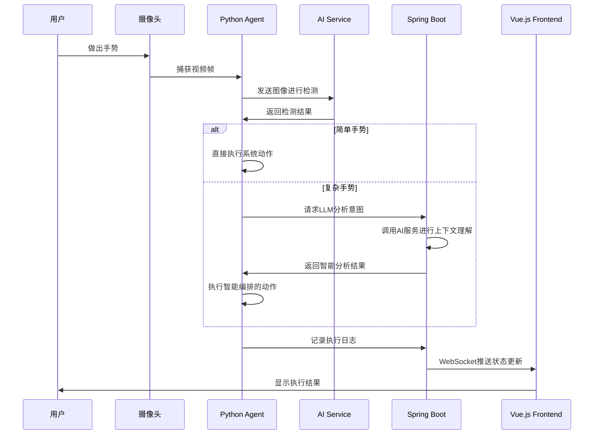
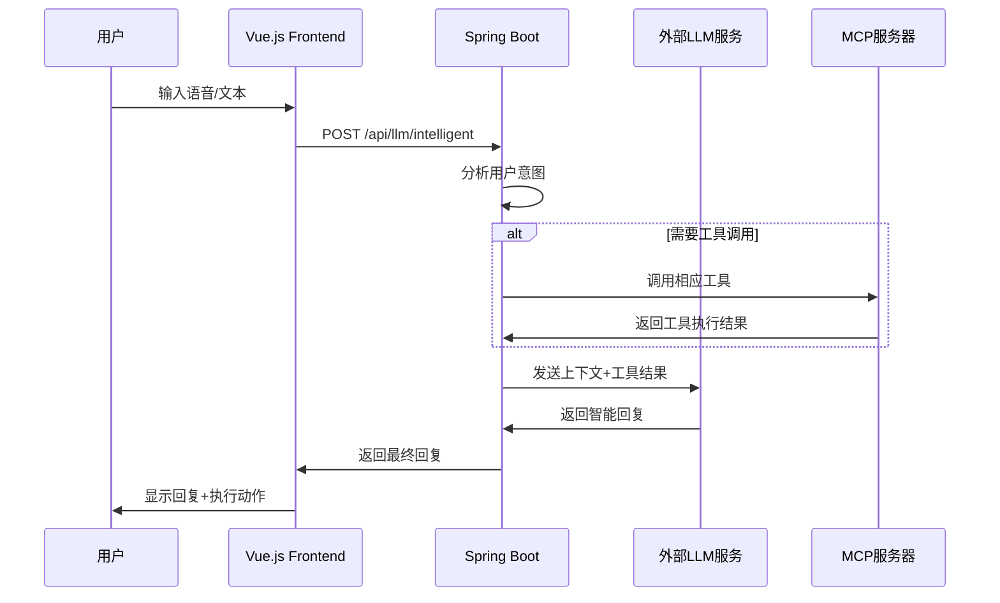

# YOLO-LLM 多服务集成架构文档

## 🌐 服务间通信架构概览

YOLO-LLM采用**微服务架构**，通过HTTP/REST和WebSocket协议实现服务间通信，形成一个完整的AI智能控制生态系统。

```
┌─────────────────────────────────────────────────────────────────────┐
│                        用户交互层                                    │
├─────────────────┬─────────────────┬─────────────────┬─────────────────┤
│   Web界面       │   手势控制       │   语音控制       │   智能对话       │
│  (Vue.js UI)    │  (MediaPipe)    │  (SpeechRec)    │    (LLM)        │
│   Port: 5173    │   本地摄像头     │   本地麦克风     │   文本输入       │
└─────────────────┴─────────────────┴─────────────────┴─────────────────┘
         │                 │                 │                 │
         │ HTTP/WebSocket  │                 │ HTTP/API        │
         ▼                 ▼                 ▼                 ▼
┌─────────────────┐ ┌─────────────────┐ ┌─────────────────┐ ┌─────────────────┐
│   Frontend      │ │     Agent       │ │   AI Service    │ │   Backend       │
│   (Vue.js)      │ │   (Python)      │ │   (FastAPI)     │ │  (Spring Boot)  │
│   Port: 5173    │ │  本地系统控制     │ │   Port: 8000    │ │   Port: 8080    │
└─────────────────┘ └─────────────────┘ └─────────────────┘ └─────────────────┘
         │                 │                 │                 │
         │ WebSocket       │ HTTP/API        │ HTTP/API        │
         ▼                 ▼                 ▼                 ▼
┌─────────────────────────────────────────────────────────────────────┐
│                        扩展服务层                                    │
├─────────────────┬─────────────────┬─────────────────┬─────────────────┤
│   MCP Server    │   外部LLM服务     │   新闻API服务    │   天气API服务    │
│   (FastAPI)     │  (DeepSeek等)    │  (NewsAPI)      │ (OpenWeatherMap) │
│   Port: 8083    │   多云支持       │   实时新闻       │   天气预报       │
└─────────────────┴─────────────────┴─────────────────┴─────────────────┘
```

## 🔄 主要集成点详解

### 1. **Frontend ↔ Backend 集成**

#### HTTP REST API通信
```javascript
// 前端API调用模式
const API_BASE_URL = 'http://localhost:8080'

// 配置管理
GET /api/config?username={username}&application={app}&os={os}

// LLM智能服务
POST /api/llm/gesture-analysis      // 手势意图分析
POST /api/llm/voice-command         // 语音命令解析
POST /api/llm/chat                  // 智能对话
POST /api/llm/intelligent           // 智能编排(MCP工具)

// 系统监控
GET /api/monitor/status             // 系统健康状态
GET /api/monitor/performance        // 性能指标
GET /api/monitor/gesture            // 手势识别状态
```

#### WebSocket实时通信
```javascript
// 前端WebSocket连接
const ws = new WebSocket('ws://localhost:8000/ws/analyze')

// 实时手势数据流
ws.send(JSON.stringify({
  type: 'image',
  data: 'data:image/jpeg;base64,<base64_image_data>'
}))

// 接收实时分析结果
ws.onmessage = (event) => {
  const result = JSON.parse(event.data)
  // 处理检测到的对象、姿态、手势、情绪
}
```

### 2. **Backend ↔ AI Service 集成**

#### HTTP客户端调用模式
```java
// Backend中的HTTP客户端配置
@Value("${ai.service.url:http://localhost:8000}")
private String aiServiceUrl;

// 手势分析调用
public String analyzeGesture(String imageData) {
    String url = aiServiceUrl + "/analyze/file";
    // 发送图像到AI服务进行多模态分析
    // 返回：检测到的对象、姿态、手势、情绪
}

// 实时WebSocket代理
public void streamAnalysis(String imageData, WebSocketSession session) {
    // 将前端WebSocket数据转发到AI服务
    // 建立Backend ↔ AI Service的WebSocket桥接
}
```

#### AI服务响应格式
```json
{
  "detections": [
    {"label": "person", "confidence": 0.95, "bbox": [x, y, w, h]},
    {"label": "computer", "confidence": 0.87, "bbox": [x, y, w, h]}
  ],
  "poses": [
    {"person_id": 1, "keypoints": [...], "confidence": 0.92}
  ],
  "gestures": [
    {"gesture": "POINT_UP", "confidence": 0.88, "hand_id": 1}
  ],
  "emotions": [
    {"emotion": "happy", "confidence": 0.76, "face_id": 1}
  ]
}
```

### 3. **Backend ↔ Agent 集成**

#### HTTP REST API通信
```python
# Agent中的API客户端
import requests

class BackendClient:
    def __init__(self, base_url="http://localhost:8080"):
        self.base_url = base_url

    def sync_config(self, username, application, os):
        """同步手势配置"""
        response = requests.get(
            f"{self.base_url}/api/config",
            params={"username": username, "application": application, "os": os}
        )
        return response.json()

    def log_execution(self, action, result):
        """记录动作执行"""
        requests.post(f"{self.base_url}/api/audit/log", json={
            "action": action,
            "result": result,
            "timestamp": datetime.now().isoformat()
        })
```

#### 智能编排集成
```python
# 复杂手势的LLM分析
def analyze_complex_gesture(gesture, context_objects):
    """复杂手势需要LLM智能分析"""
    response = requests.post(f"{self.backend_url}/api/llm/gesture-analysis", json={
        "gesture": gesture,
        "context": context_objects,
        "user_intent": "需要理解手势在当前环境中的具体含义"
    })
    return response.json()["intended_action"]
```

### 4. **Backend ↔ MCP Server 集成**

#### MCP工具调用协议
```java
// Backend中的MCP集成服务
@Service
public class MCPIntegrationService {

    @Value("${mcp.server.url:http://localhost:8083}")
    private String mcpServerUrl;

    // 调用电脑控制工具
    public MCPResponse executeComputerControl(String action, Map<String, Object> params) {
        String endpoint = "/api/computer/" + action;
        return restTemplate.postForObject(
            mcpServerUrl + endpoint,
            params,
            MCPResponse.class
        );
    }

    // 调用新闻查询工具
    public List<NewsArticle> getNews(String category, String country) {
        Map<String, String> params = Map.of(
            "category", category,
            "country", country
        );
        return restTemplate.postForObject(
            mcpServerUrl + "/api/news/search",
            params,
            NewsResponse.class
        ).getArticles();
    }
}
```

### 5. **Frontend ↔ AI Service 直接集成**

#### WebSocket实时流式处理
```javascript
// 前端直接连接AI服务用于实时处理
const aiWebSocket = new WebSocket('ws://localhost:8000/ws/gesture')

// 实时手势识别
setInterval(() => {
  if (cameraStream) {
    const frame = captureFrame()
    aiWebSocket.send(JSON.stringify({
      type: 'frame',
      data: frame
    }))
  }
}, 100) // 10fps实时处理

// 接收实时手势结果
aiWebSocket.onmessage = (event) => {
  const gestureData = JSON.parse(event.data)
  updateGestureUI(gestureData)

  // 将复杂手势转发给Backend进行智能分析
  if (gestureData.complex) {
    backendAPI.analyzeGesture(gestureData)
  }
}
```

## 🔗 数据流架构

### **实时手势控制数据流**



### **智能对话工作流**



## ⚡ 性能优化策略

### **连接池管理**
- **HTTP连接复用**: Backend服务维护AI服务的HTTP连接池
- **WebSocket连接管理**: 前端维护单个WebSocket连接，复用多个数据流
- **数据库连接池**: MyBatis-Plus连接池优化数据库访问

### **异步处理**
- **非阻塞IO**: FastAPI和Vue.js都采用异步处理模式
- **事件驱动**: WebSocket采用事件驱动的消息处理
- **并发控制**: Python Agent使用线程池处理多个并发请求

### **缓存策略**
- **模型缓存**: AI服务启动时预加载YOLO模型，避免重复加载
- **配置缓存**: Agent和Backend缓存手势映射配置
- **API响应缓存**: 非实时数据采用适当的缓存策略

## 🛡️ 安全架构

### **API安全**
```java
// Backend中的CORS配置
@Configuration
public class WebConfig implements WebMvcConfigurer {
    @Override
    public void addCorsMappings(CorsRegistry registry) {
        registry.addMapping("/api/**")
                .allowedOrigins("http://localhost:5173", "http://localhost:5174")
                .allowedMethods("GET", "POST", "PUT", "DELETE")
                .allowCredentials(true);
    }
}
```

### **数据验证**
```python
# AI服务中的输入验证
from pydantic import BaseModel

class ImageRequest(BaseModel):
    image: str  # Base64编码的图像
    max_size: int = 5 * 1024 * 1024  # 5MB限制

    class Config:
        schema_extra = {
            "example": {
                "image": "data:image/jpeg;base64,/9j/4AAQSkZJRgABAQAAAQ..."
            }
        }
```

### **错误处理与降级**
```python
# 多级降级策略
def detect_gesture(image_data):
    try:
        # 主要检测方式：MediaPipe
        return mediapipe_detector.detect(image_data)
    except MediaPipeError:
        try:
            # 备用检测方式：OpenCV
            return opencv_detector.detect(image_data)
        except OpenCVError:
            # 最终降级：返回基础检测结果
            return {"gestures": [], "fallback": "basic_detection"}
```

## 🔧 监控与诊断

### **健康检查端点**
```yaml
# 各服务的健康检查
services:
  frontend:
    health: http://localhost:5173
  ai_service:
    health: http://localhost:8000/health
  backend:
    health: http://localhost:8080/actuator/health
  mcp_server:
    health: http://localhost:8083/health
```

### **日志聚合**
```python
# 统一日志格式
LOG_FORMAT = {
    "timestamp": "%Y-%m-%d %H:%M:%S",
    "service": "yolo-llm",
    "component": "{component}",
    "level": "{level}",
    "message": "{message}",
    "request_id": "{request_id}"
}
```

### **性能监控**
- **响应时间监控**: 各API端点的响应时间统计
- **资源使用监控**: CPU、内存、GPU使用率跟踪
- **错误率监控**: 服务失败率和错误类型统计

## 📈 扩展性设计

### **水平扩展**
- **无状态服务**: Backend和AI服务设计为无状态，支持多实例部署
- **负载均衡**: 可使用Nginx进行负载均衡
- **数据库分片**: 支持MySQL读写分离和分片

### **功能扩展**
- **插件架构**: MCP协议支持动态添加新的工具服务
- **模型扩展**: AI服务支持热更新AI模型
- **协议扩展**: 支持添加新的通信协议和数据格式

这个多服务集成架构实现了高内聚、低耦合的设计原则，通过标准化的API接口和实时通信协议，构建了一个可扩展、可维护的企业级AI智能控制平台。